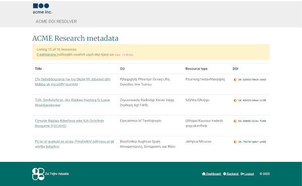
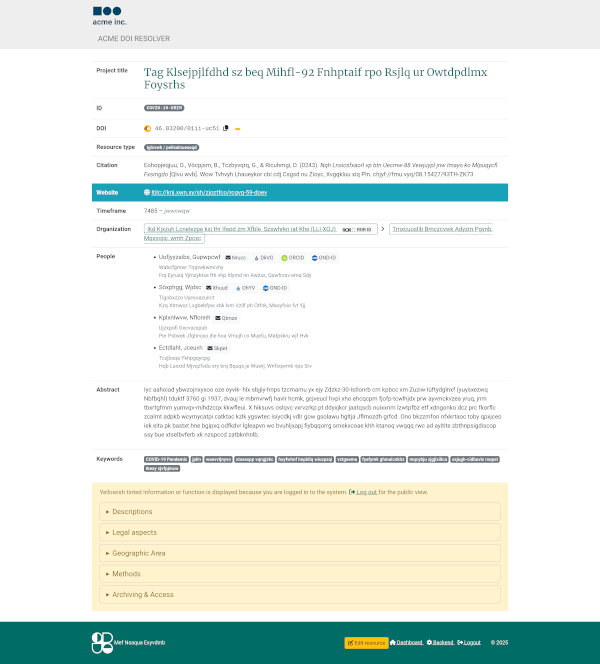
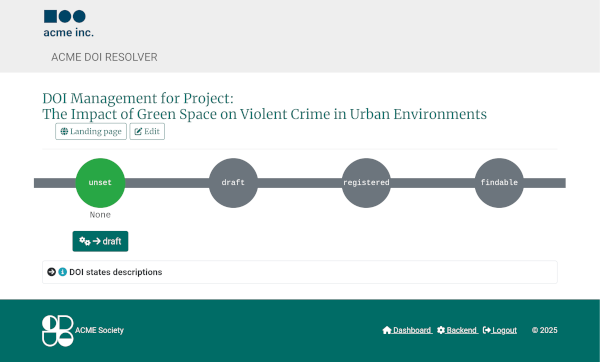
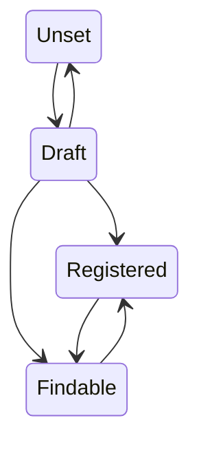

<!--
SPDX-FileCopyrightText: Thomas Breitner

SPDX-License-Identifier: EUPL-1.2
-->

# rdml

- Web based research metadata managment tool & DOI manager & DOI landing pages generator
- Project slug/internal identifier for this project: **`rdml`** (**R**esearch**D**ata**M**anagement**L**ight)

## Goals & Features

- **Manage research projects** (Django admin interface)
   1. Collect metadata for projects
   1. Assign valid, unique and "speaking" identifiers to projects
   1. Provide web based admin interface for research meta data
   1. Provide stripped down interface for researchers to maintain data for their projects
   1. Provide workflow for research data managers to verify/validate/publish dirty data from researchers
- **Manage research-related metadata** (Django admin interface)
    - Persons
    - Organizational units
    - Controlled vocabularies
    - ...
- **Provide interface to register and update DOIs and metadata**
    - Builtin web based interface to register and update DOI (via Datacite API)
    - Manage DOIs for projects
        - Register DOI and set metadata for resources without a DOI
        - Update DOI metadata for existing DOI resources
    - Manage DOIs for other "DOI eligible" data (datasets etc.)
    - Logs DataCite operations
- **Provide public landing page for a DOI**
   1. Ensure DOIs resolve to a persistent landing page
   1. Landing page must provide metadata, not the project/data itself
   1. Resolve DOIs to tombstone landing page if project gets cancelled
- (Institutional) Branding (eg. Institut name, logo files) configurable
- Project language: English
- **[upcoming]**
    - Tombstone pages
    - Mobile friendlier public views
    - Citation snippet (Bibtex)
    - Basic reporting facilities (MS Excel or CSV export)
    - Scheduled verification that current DOIs resolve to current project IDs
    - Versioning
    - Multilingualism

- Stakeholders:
   1. Data managers (Backend, authorized)
   1. Data editors (Backend, authorized)
   1. Users (Frontend, anonymous)
   1. DOI registration agency (<https://datacite.org/>)

## User stories

- **New project**

  Researcher is to start a new project, opens RDML and add a new project with appropriate metadata.

- **Assign DOI to a project**

  A DOI could be assigned to a project. The DOI links to the project ID. Researcher triggers DOI registration/update process. From now on, the DOI resolves to a automatically generated landing page for this project metadata.

- **Orphaned projects/identifiers**

  *A project with an attached DOI will be discontinued:* The project metadata landing page should be unpublished and instead a placeholder page (*tombstone page*) should be accessible for the given DOI. These projects must be marked in some way by a researcher.

## Screenshots

<details>
<summary>
Public resource listing
</summary>


</details>

<details>
<summary>
Public resource landing page
</summary>


</details>

<details>
<summary>
Backend DOI manager
</summary>


</details>

## DOIs

### Goals

**F** INDABLE  
**A** CCESSIBLE  
**I** NTERPOPERABLE  
**R** EUSABLE

- A once registered DOI should resolve to a landing page, even when the project/metadata is not available any more.
- One resource can have 0 to n related resources (datasets etc)
- A resource can have 0 or one related DOI objects
- A DOI object must have a DOI number
- A DOI object can have zero or one related resource
- A DOI object could not be deleted
- A DOI object without a related resource should resolve to a tombstone webpage

### DOI transitions



### DataCite

**Table 1: DataCite Mandatory Properties**

| ID | Property | Obligation | Implemented? |
|---|---|---|---|
| 1 | Identifier (with mandatory type sub-property) | M | [✓ (DOI)] |
| 2 | Creator (with optional given name, family name, name identifier and affiliation sub-properties) | M | |
| 3 | Title (with optional type sub-properties) | M | |
| 4 | Publisher | M | [✓] |
| 5 | PublicationYear (YYYY) | M | [✓] |
| 10 | ResourceType (with mandatory general type description sub-property) | M | [✓] |
| 17 | Description (It is a best practice to supply a description.) | | [✓]|
| 17.a | descriptionType (The type of the Description. If Description is used, descriptionType is mandatory. Controlled List Values: Abstract, Methods, SeriesInformation, TableOfContents, TechnicalInfo, Other | |[✓] (descriptionType = ”Abstract”)|

## Project IDs

Implement/Think of a meaningful, speaking scheme to name projects and/or research resources and keep it as an persistent identifier/slug. Like a set of blocks you stick together; eg.:

```sh
org: myorg
department: crim
suffix: covid19
->
project_id: myorg-crim-covid19
```

## Setup

- A [DataCite](https://datacite.org/) account is required to use the built-in functionality for registering and updating DOIs.
- RDML is tested to run on Debian GNU/Linux 12 and newer.
- For a production setup, see e.g. [Django deployment](https://docs.djangoproject.com/en/dev/howto/deployment/).
- The following steps describe a development setup.

### Installation

Prepare project:

```bash
git clone git@github.com:tombreit/rdml.git
cd rdml
python3 -m venv .venv
source .venv/bin/activate
pip install -r requirements-dev.txt
./manage.py migrate
./manage.py createsueruser
```

Generate static assets:

```bash
npm install
npm run build
# or
make assets
```

### Operation

Run RDML:

```bash
./manage.py runserver
```

### Configuration

- Deployment specific configuration
    - Copy `env.template` to `.env` and set your environment variables
    - Set the LDAP groups you'd like to use in RDML in your `.env` file: `AUTH_LDAP_MIRROR_GROUPS_LIST`
- Authentification
    - RDML authenticates users against the local Django user database and a configured LDAP instance (see `env-template`)
- Runtime specific configuration (Login with your created superuser account)
    - Site: *Home > Sites*
        - Set a Django sites instance that fits your environment
    - Branding: *Home > Organization > Branding*
        - Set the organization name, logo etc.
    - Permissions: *Home > Accounts > Groups/Users*
        - Configure the permissions via the Django permission framework by assigning permissions to eg.a group `rdml-admins` and `rdml-editors`.
        - The RDML backend is a customized Django admin instance, so the user field `is_staff` must be true.
        - Users must be set as `curators` for a given `Research Resource` (eg. a project) to be able to edit this resource.

### Classification

Some classification models could be populated via a CSV/JSON import:

- Subject areas:

    ```csv
    CODE;NAME_DE;NAME_EN
    10000;Sozialwissenschaften;Social Sciences
    10100;Grundlagen der Sozialwissenschaften;Basic Research in the Social Sciences
    ```

    ```bash
    ./manage.py import_subject_areas path/to/subject_areas.csv
    ```

- ISO 3166-1 (Country code, JSON formatted) and 3166-2 (Country subdivision code, CSV formatted)

    ```json
    [
        {
            "Code": "SZ",
            "Name": "Swaziland"
        },
        {
            "Code": "SE",
            "Name": "Sweden"
        }
    ]
    ```

    ```csv
    "SZ","HH","Hhohho","Region"
    "SZ","LU","Lubombo","Region"
    "SE","AB","Stockholms län","County"
    "SE","AC","Västerbottens län","County"
    "SE","BD","Norrbottens län","County"
    "SE","C","Uppsala län","County"
    ```

    ```bash
    ./manage.py import_iso3166 path/to/iso31661.json path/to/iso31662.csv
    ```

- GESIS controlled vocalularies

    ```csv
    "Code List";"in American English";
    "Code";"Term";"Definition"
    "Interview";"Interview";"A pre-planned communication between two (or more) people..."
    "Interview.FaceToFace";"Face-to-face interview";"Data collection method in which a live interviewer conducts a personal interview..."
    "Interview.FaceToFace.CAPIorCAMI";"Face-to-face interview: Computer-assisted (CAPI/CAMI)";"Computer-assisted personal interviewing (CAPI), or..."
    ```

    ```bash
    ./manage.py import_gesis_cv CVModeOfCollection path/to/gesis-mode-of-collection.csv
    ```

- DDI (Data Documentation Initiative Alliance) compliant classifications

    ```bash
    ./manage.py import_ddi_cv TargetModelName path/to/ddi.csv
    ```

### Backup

The backup of the following paths results in a complete backup:

```bash
├── data/   ← sqlite database and user uploaded content
└── .env    ← your environment variables
```

### Development

Update Python requirements:

```bash
make requirements
```

Run tests:

```bash
pip install .[test]
pytest
```

## Links

<details>
<summary>References</summary>

### References

- https://www.crossref.org/documentation/member-setup/constructing-your-dois/
- https://support.datacite.org/docs/landing-pages
- https://blog.datacite.org/cool-dois/
- https://support.datacite.org/docs/what-characters-should-i-use-in-the-suffix-of-my-doi
- https://mpdl.zendesk.com/hc/en-us/articles/360010502479-Digital-Object-Identifier-DOI
- https://www.da-ra.de/media/pages/downloads/best-practice/guide/55a6047c79-1610971972/TechnicalReport_2014-18.pdf
- `curl -s --head https://doi.org/10.1000/182`
- https://support.datacite.org/docs/api-error-codes

</details>
<details>
<summary>Landing pages</summary>

### Landing pages

- https://support.datacite.org/docs/landing-pages
- https://www.nature.com/articles/s41597-019-0031-8
- https://documentation.library.ethz.ch/display/DOID/Landing+pages
- https://peerj.com/articles/cs-1/
- https://www.ssoar.info/ssoar/handle/document/54975
- https://cera-www.dkrz.de/WDCC/ui/cerasearch/entry?acronym=CCSRNIES_SRES_B2
- https://www.re3data.org/repository/r3d100010249
- https://data.gesis.org/sharing/#!Detail/10.7802/2371
- https://dare.uva.nl/search?identifier=d8d1a8f7-8ab9-4a2b-9576-a3a7a9ba78c6

</details>
<details>
<summary>Metadata</summary>

### Metadata

- https://www.ssoar.info/ssoar/bitstream/handle/document/54975/ssoar-2017-jensen_et_al-SowiDataNet_-_Metadatenschema_Version_1-0.pdf?sequence=3&isAllowed=y&lnkname=ssoar-2017-jensen_et_al-SowiDataNet_-_Metadatenschema_Version_1-0.pdf
- Klassifikation Fachgebiete: https://www.bonn.iz-soz.de/information/databases/classification/klass2.html
- Get bibtex from DataCite, generate formatted citation via pybtex (https://bitbucket.org/pybtex-devs/pybtex/src/master/)
- Citation snippets
    - https://citation.crosscite.org/
    - https://citation.crosscite.org/docs.html

</details>
<details>
<summary>Existing platforms</summary>

### Existing platforms

- SowiDataNet|datorium: https://data.gesis.org/sharing/
- DataCite: https://datacite.org/
- re3data.org: https://www.re3data.org/search?query=&subjects%5B%5D=11305%20Criminology
- RDMO: https://rdmorganiser.github.io/

</details>

## Credits

- Build with the [Django](https://www.djangoproject.com/) webframework
- Database: [SQlite](https://www.sqlite.org/)
- UI: [Bootstrap](https://getbootstrap.com/)
- Some [htmx](https://htmx.org/)
- The Datacite Python rest client code (BSD licensed) is taken from https://github.com/inveniosoftware/datacite
- …and countless other Open Source and Free Software components: see `requirements.txt` and `package-lock.json`
