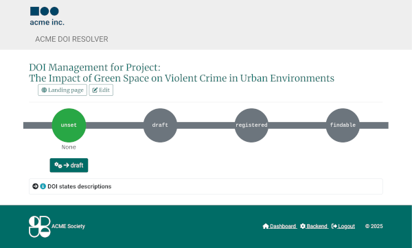

<!--
SPDX-FileCopyrightText: Thomas Breitner

SPDX-License-Identifier: EUPL-1.2
-->

# Onboarding

## TLDR

1. Get access
1. Add or edit a research resource (e.g. a project, a dataset)
1. Publish this record
1. Get a DOI
1. Done

## Interface

RDML provides two interfaces:

1. a public {{ '[*Frontend*]({base_url}/resource/)'.format(base_url=base_url) }} with a listing of resources and *Landing pages* for each resource
1. a non-public, restricted: {{ '[*Backend*]({base_url}/admin)'.format(base_url=base_url) }}

## Editing

### Permissions

To edit data, the following conditions must be met:

1. The editor must be in an authorized IP range.
1. The editor must have the appropriate LDAP/AD group memberships.
1. Depending on the group membership, a distinction can be made between "editors" and "administrators".
1. Users (registered, authorized users) can be assigned to a project or resource as "curators" and in this case are granted editing access to the respective resource.

### Data model

RDML is structured around {{ '[*Research resources*]({base_url}/admin/research/researchresource/)'.format(base_url=base_url) }} and related fields.

## DOIs

{.bg-warning w=500px align=left}
